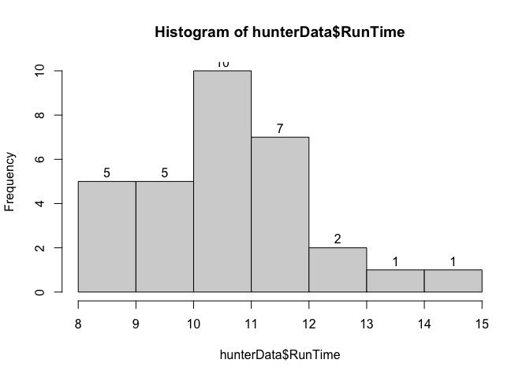
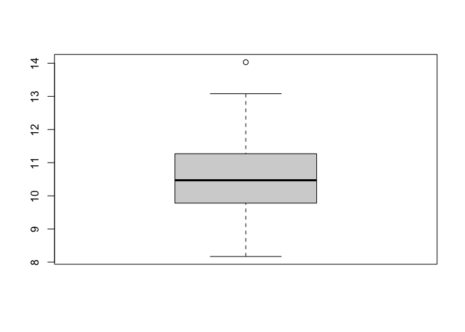
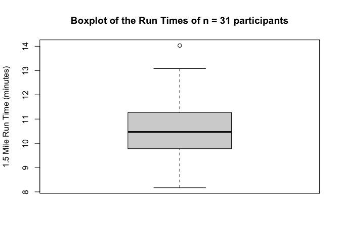

Assigmnent 1 Solutions
================
Hunter GIles
3/6/2022

# Assignment 1: Getting Started

### Question 1

``` r
3 + 4
```

    ## [1] 7

``` r
(-3 + 5 + 7 + 8)/4
```

    ## [1] 4.25

``` r
-3 + 5 + 7 + 8/4
```

    ## [1] 11

We can see that R has built in basic calculator functions. Also, R
supports ‘order of operation’ syntax.

### Question 2

``` r
# assigning vector to variable1
variable1 <- c(-3, 5, 7, 8)

# running basic methods on vector for mean and standard deviation
mean(variable1)
```

    ## [1] 4.25

``` r
sd(variable1)
```

    ## [1] 4.99166

Here we can see a numeric vector being assigned to variable1. This
vector is saved in the environment for future use. We can use the built
in functions *mean()* and *sd()*.

### Question 3

``` r
library(readr)
library(mosaic)
```

    ## Registered S3 method overwritten by 'mosaic':
    ##   method                           from   
    ##   fortify.SpatialPolygonsDataFrame ggplot2

    ## 
    ## The 'mosaic' package masks several functions from core packages in order to add 
    ## additional features.  The original behavior of these functions should not be affected by this.

    ## 
    ## Attaching package: 'mosaic'

    ## The following objects are masked from 'package:dplyr':
    ## 
    ##     count, do, tally

    ## The following object is masked from 'package:Matrix':
    ## 
    ##     mean

    ## The following object is masked from 'package:ggplot2':
    ## 
    ##     stat

    ## The following objects are masked from 'package:stats':
    ## 
    ##     binom.test, cor, cor.test, cov, fivenum, IQR, median, prop.test,
    ##     quantile, sd, t.test, var

    ## The following objects are masked from 'package:base':
    ## 
    ##     max, mean, min, prod, range, sample, sum

Installing the necessary dependencies for the remainder of the
assignment.

### Question 4

``` r
# assigning readmill data to hunterData
hunterData <- read_csv("./Data/treadmill.csv")
```

    ## Rows: 31 Columns: 8
    ## ── Column specification ────────────────────────────────────────────────────────
    ## Delimiter: ","
    ## dbl (8): Subject, TreadMillOx, TreadMillMaxPulse, RunTime, RunPulse, RestPul...
    ## 
    ## ℹ Use `spec()` to retrieve the full column specification for this data.
    ## ℹ Specify the column types or set `show_col_types = FALSE` to quiet this message.

``` r
# viewing the first and and last 6 observations
head(hunterData)
```

    ## # A tibble: 6 × 8
    ##   Subject TreadMillOx TreadMillMaxPulse RunTime RunPulse RestPulse BodyWeight
    ##     <dbl>       <dbl>             <dbl>   <dbl>    <dbl>     <dbl>      <dbl>
    ## 1       1        60.0               186    8.63      170        48       81.9
    ## 2       2        59.6               172    8.17      166        40       68.2
    ## 3       3        54.6               155    8.92      146        48       70.9
    ## 4       4        54.3               168    8.65      156        45       85.8
    ## 5       5        51.8               170   10.3       166        50       83.1
    ## 6       6        50.6               155    9.93      148        49       59.1
    ## # … with 1 more variable: Age <dbl>

``` r
tail(hunterData)
```

    ## # A tibble: 6 × 8
    ##   Subject TreadMillOx TreadMillMaxPulse RunTime RunPulse RestPulse BodyWeight
    ##     <dbl>       <dbl>             <dbl>   <dbl>    <dbl>     <dbl>      <dbl>
    ## 1      26        44.6               182    11.4      178        62       89.5
    ## 2      27        40.8               172    11.0      168        57       69.6
    ## 3      28        39.4               176    13.1      174        63       81.4
    ## 4      29        39.4               176    12.6      174        58       73.4
    ## 5      30        39.2               172    12.9      168        44       91.6
    ## 6      31        37.4               192    14.0      186        56       87.7
    ## # … with 1 more variable: Age <dbl>

Above I ran *read_csv()* to download a data-frame. Then I used *head()*
and *tail()* to examine a piece of my data-frame.

### Question 5

``` r
# Basic mean and standard deviation of the RunTime column
mean(hunterData$RunTime)
```

    ## [1] 10.58613

``` r
sd(hunterData$RunTime)
```

    ## [1] 1.387414

The chunk above displays the mean and standard deviation of the
*RunTime* column. The $ is a characteristic of a tibble. From this we
can receive a specific column (vector) of a tibble by calling  


$


.

### Question 6

``` r
# min, Q1, median, Q3, max, mean, std, n, missing
favstats(hunterData$RunTime)
```

    ##   min   Q1 median    Q3   max     mean       sd  n missing
    ##  8.17 9.78  10.47 11.27 14.03 10.58613 1.387414 31       0

``` r
# histogram
hist(hunterData$RunTime)

hist(hunterData$RunTime, labels=TRUE)
```

<!-- -->

Above returns 1 table and 2 histograms. This table displays descriptive
statistics of RunTime. The histograms display the distribution of
Runtime. The last graph includes the label argument.

### Question 7

``` r
# difference between Q1 and Q3 for RunTime
IQR <- 11.37 - 9.78

# the upper limit for outliers
11.27 + 1.5*IQR
```

    ## [1] 13.655

``` r
# boxplot
boxplot(hunterData$RunTime)
```

<!-- -->

Boxplots are also useful to display data distribution. Instead of
frequency, boxplots show quartile rage. Boxplots treat outliers
differently. If an observation is 1.5 IQRs above Q3, then it is an upper
limit outlier.

### Question 8

``` r
boxplot(hunterData$RunTime, ylab = "1.5 Mile Run Time (minutes)",
        main = "Boxplot of the Run Times of n = 31 participants")
```

<!-- -->

A picture is only worth a thousand words, if well labeled.
