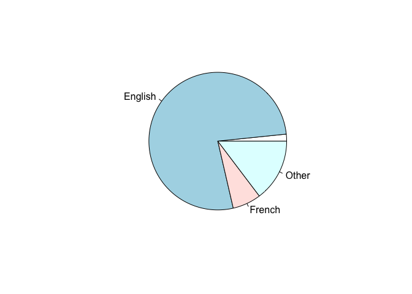
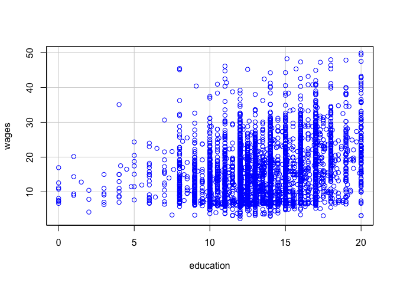

Library Workshop Exercise
================
Your Name
Type completion date

**Go to <https://research.library.gsu.edu/c.php?g=972058&p=7685877> and
complete the exercise by creating chunks and typing the codes. After
completing the exercise, you need to submit an RMD file and a knitted
WORD file. I already typed the first two codes as well as the last, but
you need to run them. **

``` r
# Run this code to load and open the data
SLID <- read.csv("https://raw.githubusercontent.com/GSU-Robinson/Data/main/SLID.csv")
```

``` r
head(SLID)
```

    ##   wages education age    sex language
    ## 1 10.56      15.0  40   Male  English
    ## 2 11.00      13.2  19   Male  English
    ## 3    NA      16.0  49   Male    Other
    ## 4 17.76      14.0  46   Male    Other
    ## 5    NA       8.0  71   Male  English
    ## 6 14.00      16.0  50 Female  English

### Frequency Tables:

Below is the code for the frequency distribution for the variable
language in the SLID dataset.

``` r
table(SLID$language)
```

    ## 
    ##         English  French   Other 
    ##     121    5716     497    1091

### Descriptive Statistics

Below is the code for calculating the descriptive statistics of the
variable wages.

``` r
summary(SLID$wages)
```

    ##    Min. 1st Qu.  Median    Mean 3rd Qu.    Max.    NA's 
    ##   2.300   9.235  14.090  15.553  19.800  49.920    3278

We can also calculate the descriptive statistics for all the variables
in one command line.

``` r
summary(SLID)
```

    ##      wages          education          age            sex           
    ##  Min.   : 2.300   Min.   : 0.00   Min.   :16.00   Length:7425       
    ##  1st Qu.: 9.235   1st Qu.:10.30   1st Qu.:30.00   Class :character  
    ##  Median :14.090   Median :12.10   Median :41.00   Mode  :character  
    ##  Mean   :15.553   Mean   :12.50   Mean   :43.98                     
    ##  3rd Qu.:19.800   3rd Qu.:14.53   3rd Qu.:57.00                     
    ##  Max.   :49.920   Max.   :20.00   Max.   :95.00                     
    ##  NA's   :3278     NA's   :249                                       
    ##    language        
    ##  Length:7425       
    ##  Class :character  
    ##  Mode  :character  
    ##                    
    ##                    
    ##                    
    ## 

### Cross Tabulation

Below is the code for conducting a crosstabulation and calculating the
Chi-squared test.

``` r
table(SLID$sex, SLID$language)
```

    ##         
    ##               English French Other
    ##   Female   55    2999    262   564
    ##   Male     66    2717    235   527

``` r
chisq.test(table(SLID$sex, SLID$language))
```

    ## 
    ##  Pearson's Chi-squared test
    ## 
    ## data:  table(SLID$sex, SLID$language)
    ## X-squared = 2.5248, df = 3, p-value = 0.4708

### Generating Variables

Below is the code for generating the variable age1 from an already
existing variable age.

``` r
SLID$age1<-SLID$age
```

### Correlations

Below is the code for calculating the sample Pearson coefficient.

``` r
cor(SLID[,c("wages", "age")], use="complete.obs")
```

    ##           wages       age
    ## wages 1.0000000 0.3614635
    ## age   0.3614635 1.0000000

``` r
cor.test(SLID$wages, SLID$age, method = "pearson")
```

    ## 
    ##  Pearson's product-moment correlation
    ## 
    ## data:  SLID$wages and SLID$age
    ## t = 24.959, df = 4145, p-value < 2.2e-16
    ## alternative hypothesis: true correlation is not equal to 0
    ## 95 percent confidence interval:
    ##  0.3347088 0.3876359
    ## sample estimates:
    ##       cor 
    ## 0.3614635

### Linear Regression

Below is the RStudio code for our linear regression.

``` r
summary(lm(wages~age + sex + education + language, data= SLID))
```

    ## 
    ## Call:
    ## lm(formula = wages ~ age + sex + education + language, data = SLID)
    ## 
    ## Residuals:
    ##     Min      1Q  Median      3Q     Max 
    ## -26.081  -4.351  -0.797   3.233  35.903 
    ## 
    ## Coefficients:
    ##                  Estimate Std. Error t value Pr(>|t|)    
    ## (Intercept)     -8.045774   1.410540  -5.704 1.25e-08 ***
    ## age              0.254676   0.008688  29.312  < 2e-16 ***
    ## sexMale          3.466147   0.208618  16.615  < 2e-16 ***
    ## education        0.920088   0.034677  26.533  < 2e-16 ***
    ## languageEnglish  0.121644   1.276452   0.095    0.924    
    ## languageFrench   0.108275   1.336288   0.081    0.935    
    ## languageOther    0.269471   1.307689   0.206    0.837    
    ## ---
    ## Signif. codes:  0 '***' 0.001 '**' 0.01 '*' 0.05 '.' 0.1 ' ' 1
    ## 
    ## Residual standard error: 6.604 on 4007 degrees of freedom
    ##   (3411 observations deleted due to missingness)
    ## Multiple R-squared:  0.2972, Adjusted R-squared:  0.2962 
    ## F-statistic: 282.5 on 6 and 4007 DF,  p-value: < 2.2e-16

### Basic Graphing

A pie chart is best for showing the proportions of occurrence of the
options in a nominal level variable.

``` r
pie(table(SLID$language))
```

<!-- -->

``` r
# This is your last chunk
library(car)
scatterplot(wages~education, regLine=FALSE, smooth=FALSE, boxplots=FALSE, data=SLID)
```

<!-- -->
