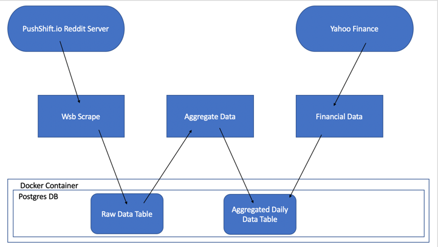

# wsb_crawler
Please note that this is a WIP project. As of now it has basic functionality. 

The wsb_scrapper is designed to collect r/wallstreetbets reddit data and yahoo finance data. The final table, 'Aggregate Table', holds information about GME, AMC, BB, and TSLA at the daily level. 

Below is the general architecture of the wsb-scrapper.


## Installation
The database is stored in a dockerized container. Make sure docker is running on port 5432 You can download docker at:
> [Download Docker](https://www.docker.com/products/docker-desktop)

Once Docker is downloaded, clone the repo.
```bash
pip install -r ./wsb_crawler/requirements.txt
``` 
Then run the following commands to get the docker container running
```bash
docker build -t wsb GSU/wsb_crawler/db/.
docker run -dp 5432:5432 --name wsb_crawler -v wsb_volume:/var/lib/postgresql/data/
```
If you wish to access your database you can run the following:
```bash
docker exec -it wsb_crawler bash
psql -U wsb
```
## Usage
### WsbScrape
You can use the 'random' argument to collect 9 out of 24 hours worth of data each day. This helps significantly with run time when there is a high volume of data. Also, it is best to use small intervals between 'start_date' and 'end_date'. 
```python
from WsbScrape import WsbScrape
start_date = '4/01/2021'
end_date = '4/06/2021'
WsbScrape(start_date='4/01/2021', end_date='4/06/2021', random=True)
```
WsbScrape collects the following information for each submission to r/wallstreetbets (unless the random argument is used):
'author', 'id', 'title', 'created_utc', and 'subreddit'. These values are then persisted into the database's wsb_submissions table. This table is also known as the raw data table.

### FinancialData
```python
from FinanceData import FinanceData
start_date = '2021-04-01'
end_date = '2021-06-01'
fin_data = FinanceData(start_date,end_date)
fin_data.collect_data()
fin_data.persist_data()
```
FinancialData downloads daily information about GME, AMC, BB, and TSLA from yahoo finance, then persists into the database's aggregate_table. 

### AggregateData
```python
from AggregateData import AggregateData
raw_data_table = 'wsb_submissions'
dates = ['2021-04-01','2021-04-02','2021-04-03','2021-04-04','2021-04-05','2021-04-06']
```
AggregateData transforms data from wsb_submissions to the aggregate_table
# Thanks
Historical Reddit data is hard to some by. This application uses the Pushshift API by u/stuck_in_the_matrix. The Pushshift API allows for easy access of historical data.
> [Pushshift docs](https://pushshift.io/)

This application also uses the pmaw wrapper, which optimizes the Pushshift API.
> [link to pmaw](https://github.com/mattpodolak/pmaw)